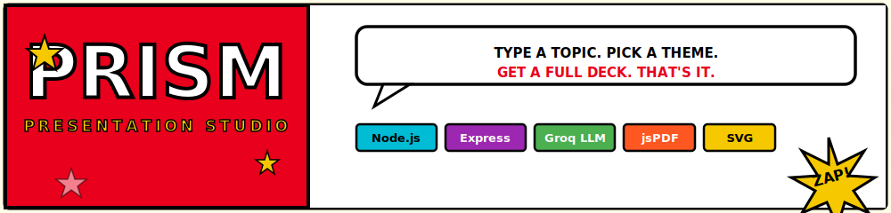
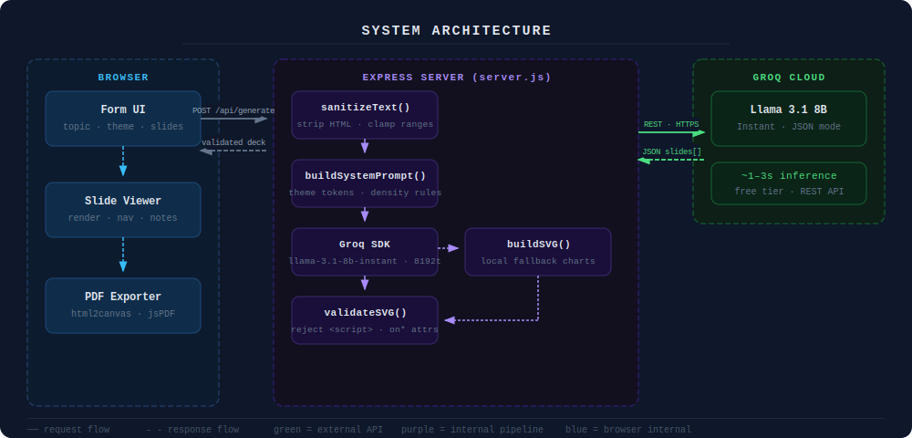
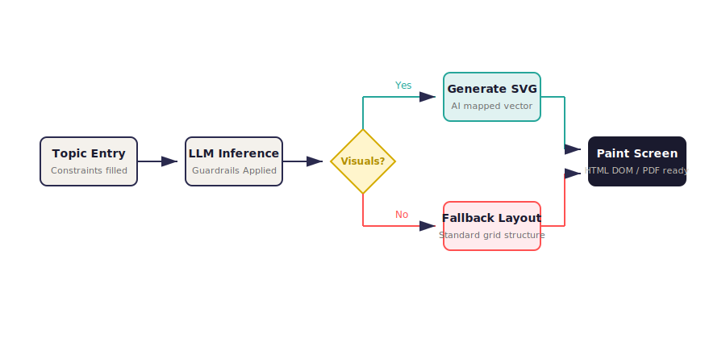

<p align="center">
  
</p>

<p align="center">
  
  
  
  
  
</p>

**Prism** is a production-ready, single-page AI presentation studio. Describe a topic, pick a theme, and generate a complete, structured slide deck with inline SVG visualizations — exported to a standard 16:9 PDF in one click.

---

## Features

| Feature | Detail |
| :--- | :--- |
| **LLM-Powered Generation** | Uses Groq's Llama 3.1 8B Instant for fast, structured JSON slide output |
| **26-Topic Generic Template** | Auto-selects the most relevant slides from a standard academic/engineering template when no topics are specified |
| **Strict Content Rules** | Max 4 bullets per slide, max 10 words per bullet — enforced both at the prompt and server level |
| **No-Hallucination Guardrails** | LLM is explicitly instructed to use qualitative markers over fabricated statistics; server validates and sanitizes all SVG output |
| **11 Themes** | Minimalist, Professional, Dark, Scientific, Cyberpunk, Brutalist, Neo-Brutalist, Colorful, Classic, Kids, Colorblind-Safe |
| **6 Visual Types** | Bar chart, line chart, pie chart, flow diagram, tree diagram, block diagram — auto-assigned semantically |
| **Standard 16:9 Export** | PDF exported at exactly 13.33 × 7.5 inches (PowerPoint widescreen standard) via jsPDF + html2canvas |
| **Keyboard Navigation** | Arrow keys navigate slides; blocked when focus is inside form inputs |
| **Security hardened** | CORS restricted to localhost, input sanitized server-side, SVG validated against script injection, no secrets committed |

---

## Architecture

<p align="center">
  
</p>

```
Browser (index_v2.html)
    │
    │  POST /api/generate  { title, theme, slides[], min/max, toggles }
    ▼
Express Server (server.js)
    │  sanitizeText()  →  validates & clamps all inputs
    │  buildSystemPrompt()  →  injects theme colors + SVG/density rules
    │  Groq SDK  →  llama-3.1-8b-instant  (max 8192 tokens)
    │  validateSVG()  →  rejects <script>, on* attributes
    │  buildSVG()  →  local fallback if LLM SVG absent/invalid
    ▼
JSON { presentation_title, theme_config, slides[] }
    │
    ▼
Browser renders slides  →  html2canvas  →  jsPDF (13.33×7.5 in)  →  .pdf
```

---

## Data Flow

<p align="center">
  
</p>

1. User fills form → `generate()` validates input client-side (title required, min ≤ max)
2. Payload sent to `POST /api/generate`
3. Server sanitizes all strings, clamps slide count to `[min, max]`
4. System prompt built with theme colors and density constraints
5. Groq returns structured JSON; server strips markdown fences, parses, validates
6. Each slide's `bullets` capped at 4 server-side; `svg_code` validated before use
7. Response hydrates the viewer; thumbnails and nav controls become active
8. Export captures each slide as a canvas at 2× scale → JPEG → jsPDF page

---

## Getting Started

### Prerequisites

- Node.js ≥ 18
- A [Groq Cloud](https://console.groq.com) API key

### Installation

```bash
git clone https://github.com/your-username/prism.git
cd prism
npm install
```

### Configuration

Copy the example env file and add your key:

```bash
cp .env.example .env
```

Edit `.env`:

```env
GROQ_API_KEY=your_groq_api_key_here
```

> The server will refuse to start if `GROQ_API_KEY` is not set.

Optional — restrict CORS origins in production:

```env
ALLOWED_ORIGINS=https://yourdomain.com
```

### Running Locally

```bash
npm start
```

Open **http://localhost:3001**

---

## Usage

1. **Title** *(required)* — Enter your presentation topic. Press `Enter` or click **Generate presentation**.
2. **Author** *(optional)* — Appears in the deck metadata.
3. **Context** *(optional)* — Target audience, key arguments, domain specifics.
4. **Theme** — Choose from 11 visual themes.
5. **Min / Max slides** — Slide count is clamped to this range. Min must be ≤ Max (red border if violated).
6. **Visualizations** — Toggle charts and/or diagrams independently.
7. **Slide Topics** *(optional)* — Add specific topics manually. Leave empty to use the built-in 26-topic template automatically adapted to your slide count.
8. Click **Generate presentation** → viewer appears below with thumbnails, slide frame, and speaker notes.
9. Navigate with **← Prev / Next →** or `Arrow` keys.
10. Click **Export PDF** to download a standard 16:9 widescreen PDF.
11. Click **← New** to reset and start a new presentation.

---

## Project Structure

```
prism/
├── server.js          # Express server — prompt engine, SVG builder, API endpoint
├── index_v2.html      # Single-page frontend — UI, renderer, PDF export
├── package.json       # Dependencies and scripts
├── .env               # Local secrets (gitignored)
├── .env.example       # Key schema for onboarding
├── .gitignore         # Ignores .env, node_modules, build artifacts
└── docs/
    └── assets/        # SVG assets used in this README
        ├── banner.svg
        ├── architecture.svg
        └── flow.svg
```

---

## API Reference

### `POST /api/generate`

Generates a complete presentation from the provided parameters.

**Request body:**

| Field | Type | Required | Default | Description |
| :--- | :--- | :---: | :--- | :--- |
| `title` | `string` | ✅ | — | Presentation topic |
| `author` | `string` | | `"Unknown"` | Author name or org |
| `details` | `string` | | `"None"` | Additional context for the LLM |
| `theme` | `string` | | `"minimalist"` | One of 11 named themes |
| `min_slides` | `number` | | `5` | Minimum slides (clamped ≥ 3) |
| `max_slides` | `number` | | `12` | Maximum slides (clamped ≤ 32) |
| `graphs_enabled` | `boolean` | | `true` | Include bar/line/pie charts |
| `diagrams_enabled` | `boolean` | | `true` | Include flow/tree/block diagrams |
| `slides` | `array` | | `[]` | Optional topic list `[{ title, needs_visual, visual_type }]` |

**Success response `200`:**

```json
{
  "success": true,
  "presentation": {
    "presentation_title": "string",
    "theme": "minimalist",
    "theme_config": { "font": "...", "bg": "...", "accent": "...", ... },
    "slides": [
      {
        "id": 1,
        "title": "string",
        "subtitle": "string",
        "bullets": ["max 4 items", "max 10 words each"],
        "needs_visual": true,
        "visual_type": "bar_chart",
        "visual_data": { "labels": [], "values": [], "title": "" },
        "svg": "<svg>...</svg>",
        "layout": "title-content-visual-right",
        "speaker_notes": "string"
      }
    ]
  }
}
```

**Error response `400` / `500`:**

```json
{ "error": "A non-empty title is required." }
```

---

## Security

| Control | Implementation |
| :--- | :--- |
| API key storage | `.env` file — never committed; hard fail on startup if missing |
| CORS | Restricted to `localhost:3001` by default; configurable via `ALLOWED_ORIGINS` |
| Input sanitization | All user strings stripped of HTML tags and dangerous characters server-side |
| SVG validation | LLM-generated SVG rejected if it contains `<script>` or `on*=` event attributes |
| Bullet enforcement | Max 4 bullets enforced both in the LLM prompt and post-processing `slice(0, 4)` |
| Static file exposure | Only `/docs` and the root HTML file are served; `.env` and `server.js` are not reachable |
| Body size limit | `express.json({ limit: '2mb' })` — prevents oversized payload attacks |

---

## Themes

| Key | Font | Style |
| :--- | :--- | :--- |
| `minimalist` | Playfair Display | Clean white, blue accent |
| `professional` | Merriweather | Navy/purple, corporate |
| `dark` | Syne | Near-black, indigo glow |
| `scientific` | Source Serif 4 | Cool blue-grey, data-focused |
| `cyberpunk` | Orbitron | Dark navy, cyan/magenta neon |
| `brutalist` | Space Mono | Ivory, red-black |
| `neo-brutalist` | DM Mono | Warm beige, gold/red |
| `colorful` | Nunito | Warm orange-purple |
| `classic` | EB Garamond | Parchment, brown |
| `kids` | Fredoka One | Pink-teal, playful |
| `colorblind-safe` | Outfit | High-contrast blue/orange |

---

## Roadmap

- [ ] Regenerate individual slide without re-running full deck
- [ ] Presentation history — auto-save locally to `localStorage`
- [ ] PPTX export (in addition to PDF)
- [ ] Custom slide topic ordering via drag-and-drop
- [ ] Theme preview before generation

---

## License

ISC — do whatever you want, just don't blame us.

---

<p align="center">Made with ☕ and mild existential dread · Antigravity</p>
