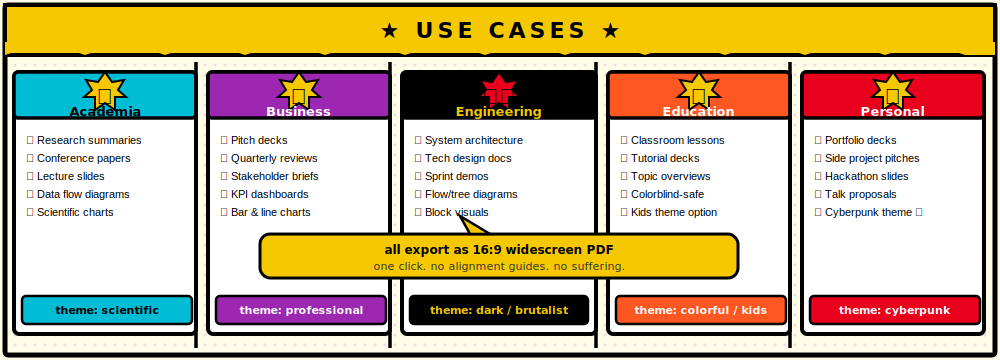

<p align="center">
  
</p>

<p align="center">
  
  
  
  
  
</p>

---

**Prism** is an AI-powered presentation studio that turns a topic, a theme, and mild optimism into a complete slide deck — complete with structured bullet points, inline SVG visualizations, and a one-click 16:9 PDF export.

No PowerPoint. No design degree. No dignity sacrificed fumbling with alignment guides at 2 AM.

---

## Why I Made This

I was tired of staring at blank PowerPoint slides, wondering if I could just describe what I wanted and have something competent appear. Turns out, yes. You can.

Prism was built to skip the part where you spend 40 minutes making a title slide look "professional" and get straight to the part where you have a full deck. It's not magic — it's just an LLM with strong opinions about bullet point length and a local Node.js server acting as a very strict intermediary.

The actual reason: I wanted a project where the boring parts (slide logic, theme tokens, SVG validation, PDF export) were all handled correctly once, so I never had to think about them again. Prism is that project. It works. It's done. This README is the proof.

---

## What It Does

1. You type a topic. Something like *"Quantum Computing for Non-Physicists"* or *"Why My Cat Is a Net Negative to Society."*
2. You pick a theme. There are 12. One of them is Cyberpunk, which is objectively the correct choice.
3. You click **Generate**.
4. Groq runs Llama 3.1 8B on your prompt at speeds that make OpenAI look like it's thinking very hard.
5. The server validates the JSON outline, enforces bullet limits, then builds all SVG visuals locally using a deterministic renderer — no second LLM call.
6. The browser renders a full slide deck — title, bullets, speaker notes, charts, diagrams — in a 16:9 viewer.
7. You click **Export PDF** and get a properly sized widescreen PDF that won't embarrass you.

The LLM is explicitly told not to invent statistics. It uses qualitative markers instead. This is a feature, not a cope.

---

## Features

| Feature | Detail |
| :--- | :--- |
| **LLM-Powered Generation** | Groq's Llama 3.1 8B Instant — fast, structured JSON outline, configurable via `GROQ_MODEL` env var |
| **Two-Phase Pipeline** | `/api/generate/outline` builds the slide structure; `/api/generate/visuals` renders all SVGs deterministically — no second LLM call |
| **12-Topic Default Template** | Leave the topic list empty and Prism auto-selects the most relevant slides from a standard 12-topic academic/engineering template |
| **Strict Content Rules** | Max 3 bullets per slide, each under 12 words — enforced at the prompt level *and* `slice(0, 3)` post-processing. Double-enforced because trust is earned |
| **No-Hallucination Guardrails** | Qualitative framing over fabricated data; SVGs are built locally from LLM-supplied `visual_data`, never from raw LLM SVG markup |
| **12 Themes** | Minimalist, Professional, Dark, Scientific, Cyberpunk, Brutalist, Neo-Brutalist, Colorful, Classic, Kids, Colorblind-Safe, Claude |
| **6 Visual Types** | Bar chart, line chart, pie chart, flow diagram, tree diagram, block diagram — semantically auto-assigned |
| **Standard 16:9 PDF Export** | Exactly 13.33 × 7.5 inches (PowerPoint widescreen standard) via jsPDF + html2canvas |
| **Keyboard Navigation** | Arrow keys work. They don't work inside form inputs. This distinction matters more than you'd think |
| **Security Hardened** | CORS locked to localhost, inputs sanitized server-side, SVG built locally (no user-supplied SVG accepted), no secrets in version control |

---

## Use Cases

<p align="center">
  
</p>

Prism doesn't care what you're presenting. As long as you give it a topic, it will produce something structured and coherent. Whether that's a PhD defence or a slide deck explaining to your team why the deployment broke on Friday — it will handle it.

---

## Architecture

<p align="center">
  
</p>

Three zones. Two API calls. No magic.

- **Browser** — the UI, the slide renderer, and the PDF exporter. Vanilla JS, no frameworks. It knows how to build a form, talk to an API, and capture DOM to canvas. That's its whole job.
- **Express Server** — the pipeline. It sanitizes input, builds the system prompt, calls Groq for the outline, post-processes the JSON, then renders all SVG visuals using a local deterministic builder. It also refuses to start without an API key, which is the most security-conscious thing it does.
- **Groq Cloud** — the actual intelligence. Llama 3.1 8B Instant (or whichever model you set via `GROQ_MODEL`) running on Groq's inference hardware. Returns structured JSON for the outline phase only. Fast enough that you'll wonder if it actually ran.

The only external dependency is Groq. Everything else runs locally. SVGs are never accepted from the LLM — the server builds them itself from `labels` + `values` data, which means no JSON-escaping nightmares and no injected markup.

```
Browser (index_v2.html)
    │
    │  POST /api/generate/outline  { title, theme, slides[], min/max, toggles }
    ▼
Express Server (server.js)
    │  sanitizeText()         →  strips HTML tags and dangerous characters
    │  buildOutlinePrompt()   →  injects theme + density rules + topic list
    │  Groq SDK               →  llama-3.1-8b-instant  (max 4000 tokens)
    │  extractJSON()          →  brace-balanced extraction (beats regex)
    │  slide post-processing  →  slice(0,3) bullets, layout override, vis toggles
    ▼
JSON { presentation_title, theme_config, slides[] }        [no SVGs yet]
    │
    │  POST /api/generate/visuals  { slides[], theme }
    ▼
Express Server (server.js)
    │  buildSVG()             →  deterministic local renderer — no LLM, no escaping
    ▼
JSON { svgs: { [slideId]: "<svg>…</svg>" } }
    │
    ▼
Browser renders slides  →  html2canvas  →  jsPDF (13.33×7.5 in)  →  .pdf
```

---

## Data Flow

<p align="center">
  
</p>

A complete lifecycle, step by step:

| Step | Where | What happens |
| :---: | :--- | :--- |
| 1 | Browser | User fills the form — topic, theme, slide count, context |
| 2 | Browser | Client validates: title required, min ≤ max. Red border if violated, no request sent |
| 3 | Browser → Server | `POST /api/generate/outline` with full JSON payload, CORS restricted to localhost |
| 4 | Server | `sanitizeText()` strips HTML, clamps slide count to `[3..32]` |
| 5 | Server | `buildOutlinePrompt()` injects theme name, visual rules, 12-topic template fallback |
| 6 | Server → Groq | Llama 3.1 8B Instant runs inference, returns structured JSON outline in ~1–3s |
| 7 | Server | `extractJSON()` finds JSON by brace-balancing; enforces 3-bullet cap via `slice(0, 3)` |
| 8 | Server → Browser | Clean `{ success, presentation: { slides[], theme_config } }` response (no SVGs yet) |
| 9 | Browser | Deck structure hydrated into viewer — thumbnails, slide frame, speaker notes become active |
| 10 | Browser → Server | `POST /api/generate/visuals` with slide list and theme |
| 11 | Server | `buildSVG()` renders each visual locally from `visual_data.labels` + `values` |
| 12 | Server → Browser | `{ svgs: { [id]: "<svg>…" } }` — browser patches each slide in-place |
| 13 | Browser | User clicks **Export PDF** → html2canvas at 2× scale → JPEG → jsPDF 13.33×7.5in |

---

## Getting Started

### Requirements

- **Node.js ≥ 18** — if you're on something older, update. The ecosystem has moved on.
- **A [Groq Cloud](https://console.groq.com) API key** — free tier exists and is more than enough for this
- **npm** — comes with Node.js
- **A browser** — yes, this is technically a requirement

### Installation

```bash
git clone https://github.com/your-username/prism.git
cd prism
npm install
```

Installs four dependencies. That's it. The entire thing is Express, Groq SDK, dotenv, and cors. No build step. No webpack. No configuration files for your configuration files.

### Configuration

```bash
cp .env.example .env
```

Open `.env` and fill it in:

```env
GROQ_API_KEY=your_groq_api_key_here
```

The server checks for this on startup and refuses to run without it. Not rudely. It just exits.

Optionally, override defaults:

```env
# Swap the model (must be available on Groq Cloud)
GROQ_MODEL=llama-3.1-8b-instant

# Restrict CORS for production deployments
ALLOWED_ORIGINS=https://yourdomain.com

# Change the port (default: 3001)
PORT=3001
```

### Run

```bash
npm start
```

Open **http://localhost:3001**. That's it. There's no step 4.

---

## Usage

1. **Title** *(required)* — What the presentation is about. Be descriptive; the LLM is not a mind reader.
2. **Author** *(optional)* — Your name. Or a pseudonym. No judgment.
3. **Context** *(optional)* — Target audience, key arguments, domain specifics. More context = better slides.
4. **Theme** — 12 options. Cyberpunk remains the correct choice.
5. **Min / Max Slides** — Slide count is clamped to this range. Min must be ≤ Max. A red border appears if it isn't.
6. **Visualizations** — Toggle charts and/or diagrams independently.
7. **Slide Topics** *(optional)* — Add specific topics manually. Leave empty to use the built-in 12-topic template, automatically adapted to your slide count.
8. Click **Generate presentation** → viewer appears with thumbnails, slide frame, and speaker notes.
9. Navigate with **← Prev / Next →** or your keyboard arrow keys.
10. Click **Export PDF** → standard 16:9 widescreen PDF.
11. Click **← New** to reset and start over.

---

## Project Structure

```
prism/
├── server.js          # Express server — prompt engine, SVG builder, API endpoints
├── index_v2.html      # Single-page frontend — UI, renderer, PDF export
├── package.json       # Four dependencies. That's the whole thing.
├── .env               # Your secrets. Gitignored. Don't commit this.
├── .env.example       # The template. Safe to commit. Already committed.
├── .gitignore         # Ignores .env, node_modules, and your past mistakes
└── docs/
    └── assets/
        ├── banner.svg          # Header banner (this README)
        ├── architecture.svg    # System architecture diagram
        ├── flow.svg            # Request data flow diagram
        └── usecases.svg        # Use case overview
```

---

## API Reference

### `POST /api/generate/outline`

Phase 1 — generates the slide structure and speaker notes. No SVGs. Fast.

**Request body:**

| Field | Type | Required | Default | Description |
| :--- | :--- | :---: | :--- | :--- |
| `title` | `string` | ✅ | — | Presentation topic |
| `author` | `string` | | `"Unknown"` | Author name or org |
| `details` | `string` | | `"None"` | Additional context |
| `theme` | `string` | | `"minimalist"` | One of 12 named themes |
| `min_slides` | `number` | | `5` | Minimum slides (clamped ≥ 3) |
| `max_slides` | `number` | | `12` | Maximum slides (clamped ≤ 32) |
| `graphs_enabled` | `boolean` | | `true` | Include bar/line/pie charts |
| `diagrams_enabled` | `boolean` | | `true` | Include flow/tree/block diagrams |
| `slides` | `array` | | `[]` | Optional topic list `[{ title, needs_visual, visual_type }]` |

**Success `200`:**

```json
{
  "success": true,
  "presentation": {
    "presentation_title": "string",
    "theme": "minimalist",
    "author": "string",
    "theme_config": { "font": "...", "bg": "...", "accent": "..." },
    "slides": [
      {
        "id": 1,
        "title": "string",
        "subtitle": "string",
        "bullets": ["max 3 items", "max 12 words each"],
        "needs_visual": true,
        "visual_type": "bar_chart",
        "visual_data": { "labels": [], "values": [], "title": "" },
        "layout": "title-content-visual-right",
        "speaker_notes": "string"
      }
    ]
  }
}
```

---

### `POST /api/generate/visuals`

Phase 2 — builds SVGs locally using the `visual_data` already returned by the outline. No LLM call.

**Request body:**

| Field | Type | Required | Description |
| :--- | :--- | :---: | :--- |
| `slides` | `array` | ✅ | Slide objects from the outline response (max 64) |
| `theme` | `string` | | Theme name — used to match colors |

**Success `200`:**

```json
{
  "success": true,
  "svgs": {
    "1": "<svg>…</svg>",
    "3": "<svg>…</svg>"
  }
}
```

Only slides with `needs_visual: true` and a recognized `visual_type` will have entries. Keys are slide `id` values.

---

### `GET /api/health`

Health check — returns `{ ok: true, version: 2 }`. Used by the frontend to verify the server is reachable before generating.

---

### Legacy: `POST /api/generate`

Returns `410 Gone` with a hard-refresh prompt. This endpoint was retired. If you're hitting it, clear your cache.

---

**Error `400` / `500`:**

```json
{ "error": "A non-empty title is required." }
```

---

## Security

Because "it works locally" is not a security posture.

| Control | Implementation |
| :--- | :--- |
| **API key storage** | `.env` file — never committed; hard failure on startup if missing |
| **CORS** | Restricted to `localhost:3001` by default; configurable via `ALLOWED_ORIGINS` |
| **Input sanitization** | All user strings stripped of HTML tags and dangerous characters server-side |
| **SVG source** | All SVGs are built locally by `buildSVG()` from structured `labels`/`values` data — the LLM never emits raw SVG markup, so there is nothing to inject |
| **Bullet enforcement** | Max 3 bullets enforced in the prompt *and* `slice(0, 3)` post-processing |
| **Static file exposure** | Only `/docs` and root HTML are served; `.env` and `server.js` are not reachable via HTTP |
| **Body size limit** | `express.json({ limit: '2mb' })` — prevents oversized payload attacks |
| **Slide count** | Clamped server-side to `[3..32]`; `min > max` is silently swapped |

---

## Themes

| Key | Font | Style |
| :--- | :--- | :--- |
| `minimalist` | DM Sans | Clean white, blue accent |
| `professional` | Merriweather | Dark navy, corporate blue |
| `dark` | Syne | Near-black, purple/pink glow |
| `scientific` | Source Serif 4 | Cool blue-grey, data-focused |
| `cyberpunk` | Orbitron | Near-black, cyan/magenta neon |
| `brutalist` | Space Mono | Pure white, red-black |
| `neo-brutalist` | Space Grotesk | Warm beige, orange/teal with hard box shadow |
| `colorful` | Nunito | Soft purple, magenta/orange |
| `classic` | EB Garamond | Parchment, amber-brown |
| `kids` | Fredoka One | Cream-yellow, pink-teal, playful |
| `colorblind-safe` | Outfit | High-contrast blue/orange |
| `claude` | Plus Jakarta Sans | Off-white, warm terracotta |

---

## Roadmap

Things that would make this better. Listed here mostly so I remember they exist.

- [ ] Regenerate individual slides without re-running the full deck
- [ ] Presentation history — auto-save to `localStorage`
- [ ] PPTX export (for the people who still live inside Microsoft Office)
- [ ] Custom slide topic ordering via drag-and-drop
- [ ] Theme preview before generation

---

## License

**ISC**

Do whatever you want with this. Fork it, deploy it, ship it to clients, name your startup after it. Just don't ask me to debug your fork.

The ISC license is functionally identical to MIT but shorter. Pick your battles.

---

<p align="center">Made with ☕ and mild existential dread · Antigravity</p>
